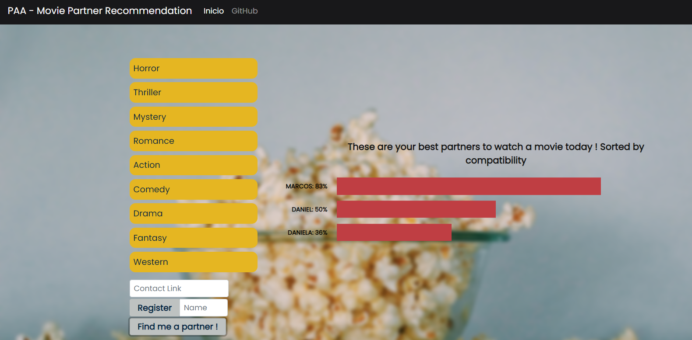

# Movie Partner Recommendation

**Número da Lista**: 4<br>
**Conteúdo da Disciplina**: D&C<br>

## Alunos
|Matrícula | Aluno |
| -- | -- |
|17/0017885  |  Marcos Nery Borges Júnior |

## Sobre 
Um passatempo muito comum para todas as idades é o Cinema. Mas como muitas coisas durante a pandemia os cinemas não estão abertos. Além disso, por conta da necessidade de evitar aglomerações, também não é possível reunir os amigos na casa de alguém para assistir um filme. Sendo assim, para que essa experiência maravilhosa de assistir filmes em grupo não seja perdida, uma das soluções é se reunir remotamente. Pode não ser a mesma coisa que uma reunião presencial mas consegue trazer parte da dinâmica.

Esse projeto tem como intuito te ajudar a achar uma pessoa que tenha gostos similares aos seus quando o assunto é conteúdo cinematográfico, para que então possam assistir filmes em conjunto. Para isso, basta ordenar os gêneros de filme na sua ordem de preferência e pronto, o algoritmo irá te sugerir os melhores parceiros. 

## Screenshots




## Instalação 
**Linguagem**: Python<br>
**Framework**: [Flask](https://flask.palletsprojects.com/en/1.1.x/installation/)<br>

Para utilizar o projeto você não precisa instala-lo. Este repositório tem um deploy no Heroku e você pode acessa-lo através da URL abaixo.

https://paa-moviepartner.herokuapp.com/

Mas, se preferir ver o projeto funcionando localmente, para instalar basta seguir uma das alternativas a seguir:

* Docker: Se você tiver o docker instalado na sua máquina basta executar um ```docker-compose up``` e acessar o seu [localhost na porta 5000](http://localhost:5000/).
* Instalação manual: Para instalar tudo manualmente, basta executar um ```pip install -r requirements.txt``` e em seguida um python ```web/app.p```, ambos na raiz do repositório. Feito isso a aplicação estará funcionando no localhost na porta indicada no terminal.

## Uso 
Para usar o projeto basta ordenar a lista de gêneros de filme em acordo com sua preferência e então clicar no botão "Find me a Partner". Feito isso você verá as cinco pessoas mais compatíveis com os seus gostos e poderá clicar em alguma delas para entrar em contato caso a pessoa tenha disponibilizado tal informação.
Além disso, você também pode inserir o seu nome e informação de contato para registrar seu usuário na aplicação e aparecer como possível match para outros usuários.


